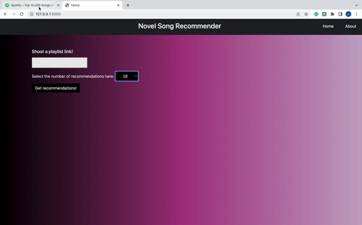

## Beat It

Beat Box generates personalized song recommendations based upon users' playlist. The dataset used in this project comes from a [playlist]( https://open.spotify.com/playlist/1G8IpkZKobrIlXcVPoSIuf?si=f11fb54e99334cd9 ) on Spotify.

### Demo 



### Installation

Clone the repository using this command:
```sh
git clone https://github.com/shivam360d/Novel_Song_Recommender.git
```

### Data Collection

We performed data collection using Spotipy package in python, where we used a playlist to populate our corpus with around 10000 songs. You can augement the corpus by updating the playlist Id in the jupter notebook named extraction-api present inside the notebooks directory. Please populate the client id and the client secret values in the same notebook. You shall refer this [document](https://developer.spotify.com/documentation/general/guides/authorization/app-settings/) to get this pair of credentials.

### Deployment

Create a virtual environment in python using the foloowing commands:
```sh
python3 -m venv venv
source venv/bin/activate (or venv\Scripts\activate if you are using Windows)
```

Installing dependencies in virtual environment:
```sh
pip3 install -r requirements.txt
```

Running the app:
```sh
cd recommendation_app
python wsgi.py
```

Visit 127.0.0.1:5000 and then beat it!

### Authors

#### Shivam Vats and Ansh Sachdeva
